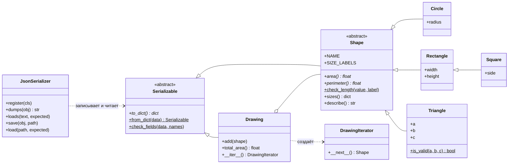

# Лабораторная работа №3 — Объектно-ориентированное программирование на Python

**Боканов Сергей Николаевич, группа 221141, вариант 4, лабораторная №3**

Дисциплина «Методы и технологии программирования» (часть 1).

Репозиторий: <https://github.com/kyoug3n/mtp-lab-3>

## Содержание

- [Цель](#цель)
- [Задания варианта 4](#задания-варианта-4)
- [Структура проекта](#структура-проекта)
- [Как запустить и проверить](#как-запустить-и-проверить)
- [1. Класс «Фигура» (средняя №4)](#1-класс-фигура-средняя-4)
- [2. Класс со статическим методом (средняя №6)](#2-класс-со-статическим-методом-средняя-6)
- [3. Класс-итератор (средняя №10)](#3-класс-итератор-средняя-10)
- [4. Сериализация объектов в JSON (повышенная №5)](#4-сериализация-объектов-в-json-повышенная-5)
- [5. Абстрактные классы abc (повышенная №9)](#5-абстрактные-классы-abc-повышенная-9)
- [Меню](#меню)
- [Понятия ООП в коде](#понятия-ооп-в-коде)
- [Тесты и PEP 8](#тесты-и-pep-8)

## Цель

Изучить классы, объекты, наследование, инкапсуляцию, полиморфизм и паттерны
проектирования.

## Задания варианта 4

Все пять заданий собраны в одну предметную область — чертёж из геометрических фигур,
который можно сохранить в JSON и загрузить обратно.

| Уровень | № | Задание | Раздел | Код | Тесты | Коммиты |
|---|---|---|---|---|---|---|
| Средний | 4 | Класс «Фигура» (площадь, периметр) | [1](#1-класс-фигура-средняя-4) | [`shapes.py`](shapelab/shapes.py): `Shape`, `Circle`, `Rectangle`, `Square`, `Triangle` | [`test_shapes.py`](tests/test_shapes.py) | `2e52932`, `8bc29c2` |
| Средний | 6 | Класс со статическим методом | [2](#2-класс-со-статическим-методом-средняя-6) | [`shapes.py`](shapelab/shapes.py): `Triangle.is_valid` | [`test_triangle.py`](tests/test_triangle.py) | `8bc29c2` |
| Средний | 10 | Класс-итератор | [3](#3-класс-итератор-средняя-10) | [`drawing.py`](shapelab/drawing.py): `Drawing`, `DrawingIterator` | [`test_drawing.py`](tests/test_drawing.py) | `487b605` |
| Повышенный | 5 | Класс для сериализации объектов в JSON | [4](#4-сериализация-объектов-в-json-повышенная-5) | [`serializer.py`](shapelab/serializer.py): `JsonSerializer` | [`test_serializer.py`](tests/test_serializer.py) | `7bc1780` |
| Повышенный | 9 | Абстрактный класс через `abc` | [5](#5-абстрактные-классы-abc-повышенная-9) | `Shape` в [`shapes.py`](shapelab/shapes.py), `Serializable` в [`serializer.py`](shapelab/serializer.py) | [`test_shapes.py`](tests/test_shapes.py), [`test_serializer.py`](tests/test_serializer.py) | `2e52932`, `7bc1780` |

Интерактивное меню (`addd754`) связывает все классы вместе. Протокол его работы с
реальным вводом и выводом записан в [`reports/demo.txt`](reports/demo.txt), фрагменты
приведены в разделах ниже.

## Структура проекта

```
mtp-lab-3/
├── shapelab/               # пакет, запуск меню: python -m shapelab
│   ├── __main__.py
│   ├── shapes.py           # средняя №4, №6, повышенная №9: Shape и фигуры
│   ├── drawing.py          # средняя №10: Drawing и DrawingIterator
│   ├── serializer.py       # повышенная №5, №9: Serializable и JsonSerializer
│   ├── console.py          # ввод: read_line, read_positive_number, ScriptedConsole
│   ├── menu.py             # интерактивное меню ShapeMenu
│   └── demo.py             # демонстрационные сессии → reports/demo.txt
├── tests/                  # unittest, по файлу на модуль + doctest из документации
├── reports/demo.txt        # протокол сессий меню
├── .gitignore
└── README.md
```

Классы и связи между ними (курсив — абстрактный метод, подчёркивание — статический
метод или метод класса; `#95;` в исходном тексте диаграммы — экранированный символ `_`):



## Как запустить и проверить

Нужен Python 3.10 или новее (в аннотациях используется запись `int | float`), внешних
зависимостей нет. Проверено на Python 3.14.5.

```bash
git clone https://github.com/kyoug3n/mtp-lab-3.git
cd mtp-lab-3

python -m shapelab                          # меню: фигуры, чертёж, JSON
python -m unittest -v                       # тесты, в том числе примеры из docstring
python -m flake8 shapelab tests             # PEP 8 (pip install flake8)
python -m shapelab.demo reports/demo.txt    # пересоздать протокол сессий
```

В начале [`reports/demo.txt`](reports/demo.txt) записаны команда, ревизия и версия Python,
на которых он получен. Тест `test_committed_report_is_up_to_date` сравнивает сессии
из файла со свежим прогоном, так что протокол не может незаметно разойтись с кодом.
Протокол и вывод тестов в этом README обновлены последним коммитом: в штампе указана
ревизия `6f3ab00`, после которой изменены только `reports/demo.txt` и `README.md`
(проверка: `git log --stat 6f3ab00..main`).

Примеры в документации классов (`>>> Triangle.is_valid(1, 2, 3)` и т. п.) — это
doctest: [`tests/test_doctests.py`](tests/test_doctests.py) выполняет их вместе с
остальными тестами, поэтому они не устаревают.

## 1. Класс «Фигура» (средняя №4)

Иерархия в [`shapelab/shapes.py`](shapelab/shapes.py): абстрактная фигура `Shape` и
четыре конкретные — `Circle` (радиус), `Rectangle` (ширина, высота), `Square`
(сторона) и `Triangle` (три стороны).

`Shape` объявляет площадь и периметр абстрактными (подробнее — в
[разделе 5](#5-абстрактные-классы-abc-повышенная-9)), а всё общее для фигур делает
сам: описание, сравнение, `repr`, запись в JSON. Для этого наследник сообщает о себе
два атрибута класса:

```python
class Circle(Shape):
    """Круг с заданным радиусом.

    >>> Circle(1).area() == math.pi
    True
    """

    NAME = "круг"
    SIZE_LABELS = {"radius": "радиус"}
```

На `SIZE_LABELS` держится многое: `sizes()`, `repr`, сравнение, вопросы меню и
`from_dict`, который создаёт фигуру вызовом `cls(**размеры)`. Поэтому контракт
проверяется в `Shape.__init_subclass__` сразу при объявлении конкретного наследника:
имена в `SIZE_LABELS` должны совпадать с параметрами конструктора (передаваемыми по
имени), для каждого нужно свойство, `NAME` обязателен. Например, наследник
`ColoredCircle(Circle)` с конструктором `(radius, color)` без правки `SIZE_LABELS` молча
терял бы цвет при записи в JSON — вместо этого объявление класса даёт
`TypeError: ColoredCircle: параметры конструктора (radius, color) не совпадают с
SIZE_LABELS (radius)`. Абстрактные наследники не проверяются.

**Полиморфизм.** Метод `describe()` написан один раз в `Shape`, но площадь и периметр
для каждой фигуры считает её собственный класс. Так же один раз написаны `__eq__`,
`__hash__` и `__repr__` — они берут размеры из `sizes()`, то есть из `SIZE_LABELS`.
Меню тоже ничего не знает о конкретных фигурах: вопросы о размерах берутся из
`SIZE_LABELS`.

**Наследование.** `Square` наследует `Rectangle` и передаёт в его конструктор
сторону дважды; площадь и периметр квадрата — унаследованные методы прямоугольника.
Такое наследование безопасно, потому что фигуры неизменяемы: «квадрату» нельзя
поменять одну ширину и получить 2 × 3. `Square(2) != Rectangle(2, 2)` — классы разные,
хотя `isinstance(Square(2), Rectangle)` истинно.

**Инкапсуляция.** Размеры хранятся в защищённых атрибутах (`_radius`, `_width`…) и
доступны только через свойства без записи: `circle.radius = -5` →
`AttributeError`. Поэтому проверки конструктора нельзя обойти, а фигуры можно класть
в множества.

**Проверки в конструкторе.** Размер — число больше нуля: строка, `None`, `bool`
(подкласс `int` в Python), `nan`, `inf` и целые больше 10³⁰⁸ отклоняются с сообщением,
где названо, какой размер неверен (`Высота: нужно число больше нуля, получено -2`).
Кроме того, площадь и периметр должны помещаться во `float`: круг радиуса 1e200 (площадь
переполняется) и квадрат со стороной 1e-200 (площадь округляется до нуля) не создаются.
Площадь и периметр всегда `float`, а размеры сохраняют исходный тип: `Circle(2).radius`
остаётся целым 2, в том числе после записи в JSON.

Тесты ([`test_shapes.py`](tests/test_shapes.py)): формулы всех фигур; **совпадение
`Square(a)` и `Rectangle(a, a)` на 1000 случайных сторонах**; закон подобия (при
увеличении размеров в k раз площадь растёт в k², периметр — в k раз) одной проверкой
для всех фигур; отказ для недопустимых размеров, неизменяемость, сравнение, хеш,
`eval(repr(shape)) == shape`; нарушения контракта `SIZE_LABELS` (лишний параметр
конструктора, лишняя подпись, позиционный параметр, нет свойства, нет `NAME`).

## 2. Класс со статическим методом (средняя №6)

`Triangle.is_valid(a, b, c)` отвечает, можно ли построить треугольник с такими
сторонами:

```python
    @staticmethod
    def is_valid(a: object, b: object, c: object) -> bool:
```

```python
        try:
            for side in (a, b, c):
                Shape.check_length(side, "сторона")
        except (TypeError, ValueError):
            return False
        small, middle, large = sorted(
            Fraction(side) for side in (a, b, c)  # type: ignore[arg-type]
        )
        return large - middle < small
```

Статическим метод сделан потому, что ему не нужен ни объект, ни класс — только три
числа, и спросить нужно **до** создания объекта. Этим же методом пользуется
конструктор, поэтому `is_valid` и `Triangle(...)` не могут разойтись (тест перебирает
все тройки от −1 до 7). Метод никогда не бросает исключений: для строк, `bool`, нуля,
`nan` ответ просто `False`.

Три вида методов в проекте рядом:

| Вид | Пример | Что получает | Зачем |
|---|---|---|---|
| Обычный | `shape.area()` | объект `self` | работает с данными конкретной фигуры |
| Статический `@staticmethod` | `Triangle.is_valid(3, 4, 5)`, `Shape.check_length(x, "радиус")` | ничего, только аргументы | проверка значений, объекта ещё нет |
| Класса `@classmethod` | `Square.from_dict({"side": 2})` | класс `cls` | создать объект: `cls(**data)` создаёт квадрат для `Square` и круг для `Circle` |

**Точное сравнение.** Неравенство треугольника проверяется в `Fraction`, без
округлений. Стороны `2**53 + 1`, `2**53`, `1` — отрезок (`2**53 + 1 = 2**53 + 1`), но во
`float` вычитание дало бы `(2**53 + 1) − 2**53 = 0 < 1`, потому что
`float(2**53 + 1) == 2**53`, и отрезок сошёл бы за треугольник. Обратная сторона —
`is_valid` честно отвечает про те числа, которые получил: `0.1`, `0.2` и `0.3` во
`float` хранятся приближённо, `0.1 + 0.2 > 0.3`, и для них это не отрезок, а очень
тонкий треугольник (это показано в docstring и тесте).

**Площадь — формула Герона в устойчивой записи Кэхэна.** Обычная запись
`sqrt(p(p − a)(p − b)(p − c))` теряет точность у «игольчатых» треугольников: `p` почти
равно длинной стороне, и разность `p − a` вычисляется с большой относительной ошибкой.
В записи Кэхэна стороны упорядочены (`a ≥ b ≥ c`) и вычитаются только близкие числа — такая
разность во `float` точна. Сравнение с точной площадью (дроби `Fraction` и корень с 50
знаками в `Decimal`):

| Стороны | Точная площадь | Обычная формула (ошибка) | Наша (ошибка) |
|---|---|---|---|
| 3, 4, 5 | 6 | 6.0 (0) | 6.0 (0) |
| 100000, 99999.99979, 0.00029 | 10.000000077021038 | 9.999999809638329 (2.7·10⁻⁸) | 10.000000077021038 (0) |
| 10⁸, 10⁸, 10⁻³ | 50000 | 49999.356269836426 (1.3·10⁻⁵) | 50000.0 (0) |
| 0.1, 0.2, 0.3 | 2.88559745714621·10⁻¹⁰ | 5.771194914292422·10⁻¹⁰ (100 %) | 2.8855974571462107·10⁻¹⁰ (2.2·10⁻¹⁶) |

Корень берётся из каждого из четырёх множителей отдельно, поэтому произведение не
переполняется раньше площади: у равностороннего треугольника со стороной 1e150
площадь ≈ 4.3·10²⁹⁹ считается, хотя произведение множителей ≈ 10⁶⁰⁰.

Тесты ([`test_triangle.py`](tests/test_triangle.py)): таблица случаев во всех
перестановках сторон; `is_valid` — именно `staticmethod` и вызывается и через класс, и
через объект; точность сравнения на `2**53`; согласие с конструктором; **площадь против
формулы шнурования по координатам вершин на 3000 случайных треугольниках** (площадь по
целым координатам считается точно); **1000 «игольчатых» треугольников с
относительной ошибкой меньше 10⁻¹⁴** против точной площади; строки таблицы выше.

## 3. Класс-итератор (средняя №10)

[`shapelab/drawing.py`](shapelab/drawing.py): чертёж `Drawing` хранит фигуры в порядке
добавления, а обходит их отдельный класс `DrawingIterator`. Протокол итерации — два
метода: `Drawing.__iter__()` каждый раз создаёт **новый** итератор, а
`DrawingIterator.__next__()` выдаёт очередную фигуру или бросает `StopIteration`:

```python
        if self._finished:
            raise StopIteration
        if self._drawing._current_version() != self._version:
            raise RuntimeError("Чертёж изменился во время обхода")
        shape = self._drawing._shape_at(self._index)
        if shape is None:
            self._finished = True
            raise StopIteration
        self._index += 1
        return shape
```

С чертежом итератор общается только через два внутренних метода — `_shape_at(index)`
и `_current_version()`, — а не читает его атрибуты: как чертёж хранит фигуры, итератор
не знает (тест подставляет ему объект, который вообще не хранит фигур, а создаёт их на
лету). Сравнение чертежей `__eq__` тоже берёт фигуры другого чертежа его итератором.

Почему два класса, а не один с `__iter__`, возвращающим `self`: итератор помнит
позицию и поэтому одноразовый, а чертёж можно обходить сколько угодно раз, в том числе
двумя вложенными циклами — у каждого цикла свой итератор. Ещё две детали:

- после конца итератор **всегда** бросает `StopIteration`, даже если на чертёж потом
  добавили фигуры, — так требует протокол;
- изменение чертежа во время обхода — `RuntimeError`, как у словаря
  (`dictionary changed size during iteration`), иначе добавленные фигуры попадали бы в
  обход непредсказуемо. Для этого чертёж считает изменения, а итератор сверяет номер
  через `_current_version()`.

На этом протоколе работают `for`, `list()`, `max()`, `in`, распаковка
`first, *_, last = drawing` — всё это проверено тестами. Меню выводит чертёж обычным
`for` через `enumerate(self.drawing, start=1)`:

```
Номер: 2
--- Показать чертёж ---
Фигур на чертеже: 4
  1. Круг (радиус = 2): площадь 12.5664, периметр 12.5664
  2. Прямоугольник (ширина = 3, высота = 4.5): площадь 13.5, периметр 15
  3. Квадрат (сторона = 0.5): площадь 0.25, периметр 2
  4. Треугольник (сторона a = 3, сторона b = 4, сторона c = 5): площадь 6, периметр 12
Общая площадь: 32.3164
```

Общая площадь считается `math.fsum` по тому же итератору: сложение по одному теряет
младшие разряды (`1e16 + 1 + 1 + …` остаётся `1e16`), а `fsum` — нет; тест это
показывает.

Тесты ([`test_drawing.py`](tests/test_drawing.py)): `iter()` возвращает именно
`DrawingIterator`, ручной `next()` до `StopIteration`, порядок, повторный обход,
одноразовость итератора, вложенные циклы (n² пар), итератор остаётся исчерпанным,
`RuntimeError` при изменении, встроенные функции, `TypeError` при добавлении не фигуры.

## 4. Сериализация объектов в JSON (повышенная №5)

[`shapelab/serializer.py`](shapelab/serializer.py): класс `JsonSerializer` записывает
в JSON объекты любых зарегистрированных классов-наследников `Serializable` и
восстанавливает их. О фигурах он ничего не знает: тесты проверяют его и на
посторонних классах.

```python
SERIALIZER = JsonSerializer([*SHAPE_CLASSES, Drawing])
```

**Формат.** Объект — JSON-объект с полем `"type"` (имя класса) и полями из `to_dict()`;
вложенные объекты и списки обрабатываются рекурсивно. Чертёж из первой сессии
[`reports/demo.txt`](reports/demo.txt):

```
--- файл drawing.json ---
{
  "type": "Drawing",
  "shapes": [
    {
      "type": "Circle",
      "radius": 2
    },
    {
      "type": "Rectangle",
      "width": 3,
      "height": 4.5
    },
    {
      "type": "Square",
      "side": 0.5
    },
    {
      "type": "Triangle",
      "a": 3,
      "b": 4,
      "c": 5
    }
  ]
}
```

Во второй сессии (новый запуск меню) этот файл загружается, и чертёж совпадает.
Числа сохраняют тип (`2` и `2.0` различаются) и точное значение: `json` записывает
`float` кратчайшей записью, которая читается обратно в то же число.

**Почему регистрация.** Класс выбирается по имени из файла, и произвольное имя не
должно создавать произвольные объекты. Регистрировать можно только конкретных
наследников `Serializable`: абстрактный `Shape` отклоняется (`inspect.isabstract`),
конфликт имён — ошибка. `register` возвращает класс и работает как декоратор.

**Проверки при чтении.** Файл пишет человек или другая программа, поэтому любая
ошибка — `SerializationError` (наследник `ValueError`) с указанием места, а не
падение программы или испорченный объект. Сессия 3 из протокола:

| Файл | Содержимое | Сообщение |
|---|---|---|
| `broken.json` | `{"type": "Drawing", "shapes": [` | `Некорректный JSON: Expecting value (строка 2, столбец 1)` |
| `nan.json` | `… "radius": NaN …` | `NaN — не число: в JSON нет такой константы` |
| `negative.json` | второй фигурой круг с радиусом −2 | `shapes[1] (Circle): Радиус: нужно число больше нуля, получено -2` |
| `hexagon.json` | фигура `Hexagon` | `shapes[0]: неизвестный тип «Hexagon»` |
| `twice.json` | `{"type": "Circle", "radius": 1, "radius": 2}` | `Поле «radius» повторяется в объекте` |
| `circle.json` | круг вместо чертежа | `Ожидался объект Drawing, а в JSON — Circle` |

Две строки таблицы — про особенности модуля `json`, которые пришлось закрыть явно:

- `json.loads` по умолчанию **принимает** `NaN` и `Infinity`, хотя в стандарте JSON их
  нет, а `json.dumps` их пишет. Здесь чтение отклоняет их (`parse_constant`), запись
  идёт с `allow_nan=False`, числа вроде `1e400`, которые `float` превращает в
  бесконечность, тоже отклоняются (`parse_float`);
- при повторяющемся ключе `json.loads` молча берёт последнее значение — здесь это
  ошибка (`object_pairs_hook`).

Остальное: отсутствующие и лишние поля (`нет поля «radius»`, `лишнее поле «r»`),
`"type"` не строка, `true` или `"2"` вместо числа (значения проверяют конструкторы
классов — те же проверки, что при создании из меню), слишком глубокая вложенность
(`[[[[…` из 100 000 скобок), файл не в UTF-8. Файл с меткой BOM, который может
сохранить Блокнот Windows, читается. При записи JSON строится до открытия файла:
если объект нельзя сериализовать, существующий файл не портится.

Тесты ([`test_serializer.py`](tests/test_serializer.py)): прямой и обратный путь для
всех фигур; **200 случайных чертежей**: после записи и чтения равны исходным и имеют тот
же `repr` (классы и типы чисел); точный вид JSON; посторонний класс `Point` и
декоратор `register`; все ошибки записи и чтения выше; файлы — во временной папке.

## 5. Абстрактные классы abc (повышенная №9)

Абстрактных классов два.

**`Shape`** — интерфейс фигуры:

```python
class Shape(Serializable):
```

```python
    @abstractmethod
    def area(self) -> float:
        """Площадь фигуры."""

    @abstractmethod
    def perimeter(self) -> float:
        """Периметр фигуры."""
```

**`Serializable`** — контракт для сериализатора: абстрактный метод `to_dict()` и
абстрактный метод класса `from_dict()` (декораторы `@classmethod` и `@abstractmethod`
вместе). `Shape` реализует оба один раз для всех фигур, а `Drawing` — свои.

Что даёт `abc` по сравнению с базовым методом, бросающим `NotImplementedError`:
ошибка возникает **при создании объекта**, а не при первом вызове забытого метода,
может быть, спустя много времени:

```
>>> Shape()
Traceback (most recent call last):
  ...
TypeError: Can't instantiate abstract class Shape without an implementation for abstract methods 'area', 'perimeter'
```

Тесты: `Shape()` и `Serializable()` — `TypeError`; наследник, реализовавший только
`area`, не создаётся, а в сообщении названо `perimeter`; наследник, реализовавший оба
метода, сразу получает `describe()` и `repr` от базового класса. Тест меню добавляет в
список `SHAPE_CLASSES` тестовый класс «правильный шестиугольник» — и он появляется в
меню и создаётся, хотя код меню не меняется: меню пользуется только общим интерфейсом
`Shape`.
`JsonSerializer.register` использует `inspect.isabstract`, чтобы не принять
абстрактный класс.

## Меню

[`shapelab/menu.py`](shapelab/menu.py), класс `ShapeMenu`: добавить фигуру, показать
чертёж, сохранить в JSON, загрузить из JSON. Неверный ввод переспрашивается, слово
`выход` отменяет текущее действие, конец ввода (Ctrl+Z/Ctrl+D) завершает программу.
Фрагмент первой сессии из [`reports/demo.txt`](reports/demo.txt):

```
Номер: 1
--- Добавить фигуру ---
Вид фигуры:
  1. Круг
  2. Прямоугольник
  3. Квадрат
  4. Треугольник
Номер: 1
Радиус: -2
Нужно число больше нуля.
Радиус: abc
Нужно число, например 2 или 1,5.
Радиус: 2
Добавлено: Круг (радиус = 2): площадь 12.5664, периметр 12.5664
```

```
Номер: 4
Сторона a: 1
Сторона b: 2
Сторона c: 10
Фигура не добавлена. Из сторон 1, 2, 10 треугольник не построить: 10 ≥ 1 + 2.
```

Меню получает функции ввода и вывода параметрами (`ShapeMenu(input_func,
output_func, directory)`), поэтому тесты и `demo.py` подставляют заранее заданный ввод
через `ScriptedConsole`, а файлы пишут во временную папку — в протокол её путь не
попадает. Целые размеры остаются `int`, дробная часть вводится через точку или
запятую.

## Понятия ООП в коде

| Понятие | Где |
|---|---|
| Класс, объект, конструктор `__init__` | все модули; `Circle(2)`, `Drawing([...])`, `JsonSerializer([...])`, `ShapeMenu(...)` |
| Инкапсуляция | размеры в `_radius`, `_width`… и свойства без записи; список `Drawing._shapes` меняется только через `add` с проверкой типа |
| Наследование | `Circle`, `Rectangle`, `Triangle` ← `Shape` ← `Serializable`; `Square` ← `Rectangle`; `Drawing` ← `Serializable`; `SerializationError` ← `ValueError` |
| Полиморфизм | `describe()`, `total_area()`, меню и тест закона подобия работают с любой фигурой; `JsonSerializer` вызывает `to_dict`/`from_dict` любого класса |
| Абстрактные классы (`abc`) | `Shape`, `Serializable` |
| `@staticmethod` | `Triangle.is_valid`, `Shape.check_length`, `Serializable.check_fields`, `ShapeMenu._choose` |
| `@classmethod` | `Shape.from_dict`, `Drawing.from_dict` |
| `@property` | размеры фигур |
| Специальные методы | `__eq__`, `__hash__`, `__repr__`, `__len__`, `__iter__`, `__next__` |
| Атрибуты класса | `NAME`, `SIZE_LABELS` у фигур |
| Собственное исключение | `SerializationError` |

Из паттернов, названных в методичке, в варианте 4 нет ни одного задания, поэтому
Singleton, Factory и Strategy отдельно не реализованы.

## Тесты и PEP 8

```
$ python -m unittest -q
----------------------------------------------------------------------
Ran 134 tests in 0.458s

OK
$ python -m flake8 shapelab tests
$ echo $?
0
```

Тесты, которые не просто проверяют отдельные значения, а подтверждают утверждения
этого README:

| Утверждение | Тест |
|---|---|
| Квадрат ведёт себя как прямоугольник с равными сторонами | `test_square_matches_rectangle_with_equal_sides` — 1000 случайных сторон |
| Площадь треугольника верна | `test_matches_shoelace_formula_on_random_triangles` — 3000 треугольников против формулы шнурования |
| Формула Кэхэна точна там, где обычная ошибается | `test_needle_triangles_are_accurate`, `test_naive_formula_fails_where_ours_does_not` |
| `is_valid` и конструктор согласованы | `test_agrees_with_constructor` — все тройки от −1 до 7 |
| Сравнение сторон точное | `test_comparison_is_exact` |
| Итератор одноразовый, чертёж — нет | `test_iterator_is_single_use`, `test_nested_loops_use_independent_iterators` |
| JSON сохраняет классы, типы и значения | `test_random_drawings_keep_types_and_exact_values` — 200 случайных чертежей |
| Меню не зависит от конкретных фигур | `test_new_shape_class_appears_without_changing_menu` |
| Контракт `SIZE_LABELS` нельзя нарушить незаметно | `SubclassContractTests` |
| Протокол соответствует коду | `test_committed_report_is_up_to_date` |

Случайные данные в тестах берутся из `random.Random(4)`, поэтому прогоны
воспроизводимы.
